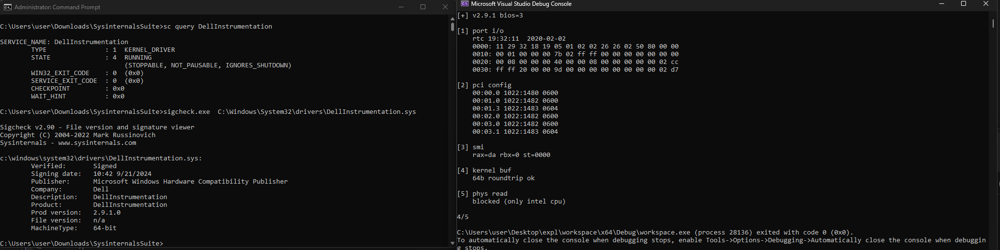
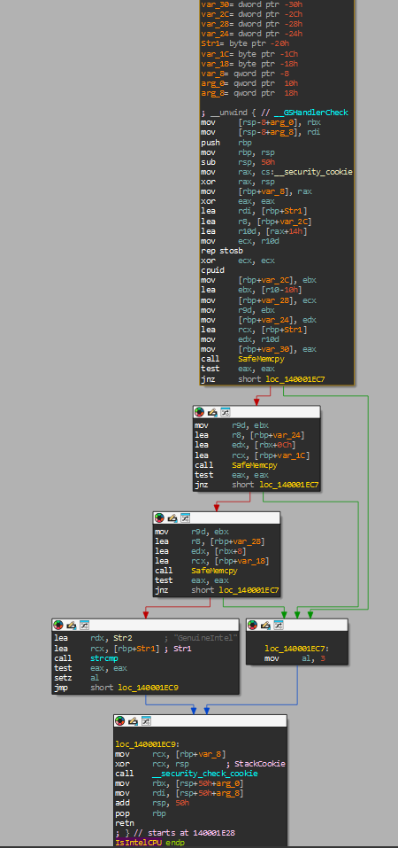

# DellInstrumentation.sys PoC

Proof of concept for abusing a Dell-signed KMDF driver (`DellInstrumentation.sys` v2.9.1) to perform privileged hardware operations from usermode.

The driver exposes a device at `\\.\Dell_Instrumentation` and accepts IOCTL requests that grant direct access to I/O ports, PCI config space, SMI triggers, kernel memory buffers, and physical memory reads. All from an unprivileged (but admin-elevated) usermode process. The driver is legitimately signed by Dell.


## What it does

The PoC opens a handle to the driver, authenticates with a hardcoded cookie (`0x44454C4C00000001` - literally "DELL" in ASCII lmao), and runs five checks:

| # | Test | IOCTL | does |
|---|------|-------|--------------|
| 1 | Port I/O | `0x9B0C1F88` | Reads CMOS/RTC time via ports `0x70`/`0x71` |
| 2 | PCI Config | `0x9B0C1F48` | Enumerates PCI devices on bus 0 (vendor, device, class) |
| 3 | SMI Trigger | `0x9B0C1F00` | Fires a System Management Interrupt with controlled register state |
| 4 | Kernel Buffer | `0x9B0C1F00` | Round-trips 64 bytes through a kernel pool allocation |
| 5 | Phys Read | `0x9B0C1E48` | Reads physical memory at `0xFED00000` (Intel CPUs only) |

## AMD 


Physical memory read (`kPhysRead`) only works on Intel CPUs. The driver sets a flag at init time and rejects the call on AMD.


## IOCTLs

All IOCTLs go through `DeviceIoControl` with the same buffer used for both input and output. A session cookie must be set first via `kSetCookie` before the driver will accept any other requests.

```
kSetCookie   0x9B0C1FC4   Authenticate with 8-byte cookie
kGetVersion  0x9B0C1FC0   Get driver version and lock state
kBiosCmd     0x9B0C1F00   SMI trigger or kernel buffer pass-through
kPciRead     0x9B0C1F48   Read PCI configuration space
kPortWR      0x9B0C1F88   Read/write I/O ports
kPhysRead    0x9B0C1E48   Read physical memory
```

## Structures

All structures use `#pragma pack(1)` for exact binary layout across the kernel boundary:

```cpp
CookieBuf   // 8 bytes  - session cookie
VersionBuf  // 12 bytes - driver version, lock flag, BIOS type
PortBuf     // 28 bytes - port addresses, sizes, values
PciHdr      // 40 bytes - bus/dev/fn/offset, followed by variable data
SmiBuf      // 72 bytes - register state (rax-rdi), trigger flag, status
PhysHdr     // 16 bytes - cookie + physical address, followed by variable data
```


## Tested on

- Windows 11 x64 25H2
- DellInstrumentation.sys v2.9.1 (signed Sep 2024)
- AMD Ryzen  (4/5 checks pass i wasnt able to test on intel)

